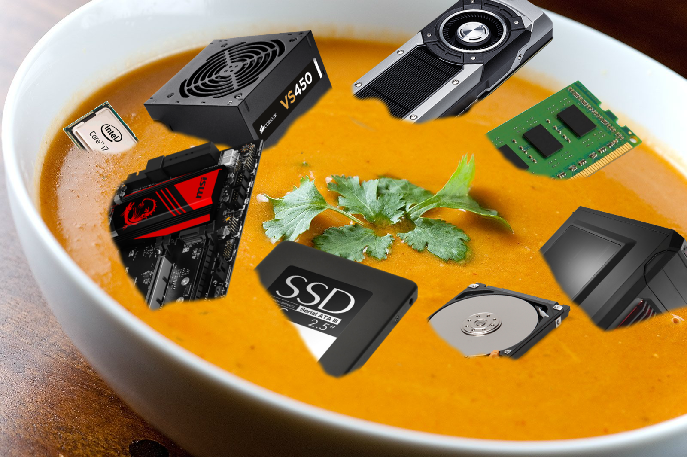

#1. Fyrir hvað stendur skammstöfunin RAM? Útskýrðu hvað RAM er.
###	Ram Stendur Fyrir Random Access Memory og er tölvuminni sem tekur jafn langan tíma að skrifa í eða lesa úr gögn óháð því hvaða minnisvistfang gögn eru sótt eða skrifuð í.

#2. Fyrir hvað stendur skammstöfunin ROM? Útskýrðu hvað ROM er.
###	ROM er minni sem er oft notað í nánu samræmi við vélbúnað tölvunar vegna þess hversu hægt og erfitt er að skrifa á það

#3. Hvað er fyrirbyggjandi viðhald?
###	Að viðhalda tölvunni sinni rétt

#4. Fyrir hvað stendur skammstöfunin ESD, hvað er það og hvaða leiðir höfum við til að verjast því þegar unnið er með tölvubúnað?
###	Electrostatic discharge, að tengja sig við jörð

#5. Hvað þarf að hafa í huga við val á spennugjöfum?
###	Spennugjafinn er folin með í huga hversu mikið afl móðurborðir þarf meðal annars

#6. Hver eru hin 6 skref við bilanagreiningu og viðgerðir?
###	1. Skilgreina Vandamálið
###	2. Koma upp með líklegustu gallana
###	3. Geri prufur til þess að sjá hvort þau líklegustu séu vandamálið
###	4. Koma með áætlun til þess að leysa vandann og finna lausninna
###	5. Prufa hvort að kerfið virki ekki alveg örugglega eftir á og ef hægt reyna að koma í veg fyrir fyrirsjáanlega galle
###	6. Skrá niður lausn og nótur þannig að þær gæti nýst við líku vandamáli ef ekki hinu sömu í framtíðinni

#7. Hver er munurinn á opinn (e. open ended) og lokaðri (closed ended) spurningu? Nefnið dæmi um báðar gerðir af spurningum.
###	Opin spurning er spurning sem að leyfir svarandanum að svara á frjálsan hátt.
###	Lokuð spurning er spurning sem að minnkar valkosti svarandas niður í svör ein og t.d. Já, Nei, A, B eða C
###	**Líður þér vel** _VS_ **Hvernig líður þér**

#8. Hvað eru jaðartæki?
###	Outputs og Inputs, hlutir sem gers okkur kleyft að hafa samskipti við tölvunna

#9. Nefndu þrjú dæmi um inntakstæki.
###	Lyklaborð, Mús, Usb Tengi o.s.f.v.

#10. Notaðu vefsíður íslenskra tölvuverslana til að velja íhluti til að setja saman góða leikjatölvu. Þú ert með fjármagn upp á 250 þúsund krónur. Settu upp töflu þar sem fram kemur hvaða íhluti þú valdir, hvað hver íhlutur kostar og hvar hann fæst.
|Íhlutur                |Gerð                   |Verð                   |Sölu Aðilli            |
| --------------------- |:--------------------- | ---------------------:|:--------------------- |
|Móðurborð              |Asus Z170-Pro Gaming   |27.855                 |att.is                 |
|Aflgjafi               |Aerocool KCAS 800W     |14.500                 |Kísil Dalur            |
|Örgjörvi               |Intel i7 6700K         |48.900                 |Tölvu Tækni            |
|Minni                  |32GB DDR4              |29.900                 |Tölvu Tækni            |
|Skjákort               |Geforce GTX 1070 8 GB  |66.900                 |computer.is            |
|SSD                    |250 GB Samsung 750 EVO |15.900                 |Tölvu Tækni            |
|Harður Diskur          |2 TB Samsung M9T 5400  |18.500                 |Kísil Dalur            |
|Turn                   |Cooler Master Silencio |17.991                 |Tölvu Listinn          |
|Niðurstaða		          |Helvítið Flott Tölva	  |440.446		            |Benedikt Aron		      |

